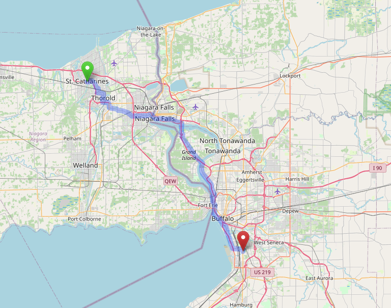
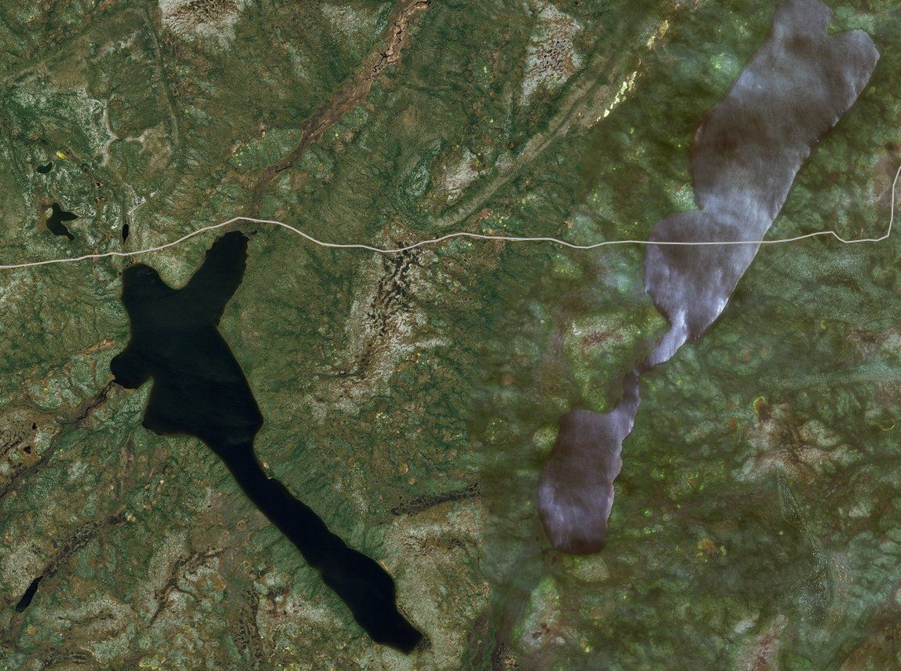

# OpenStreetMap

This document is meant to introduce the reader to OpenStreetMap - what it is, how to use it, and when and why you might want to. I will primarily write this for an audience that has some interest in making maps, and who may want to go beyond maps (visuals) to think about how data can be used for analytic, spatial analysis applications. I hope the reader will have some familiarity with QGIS, and/or Python, for which there will be some example code, but most of the information here should generalize to other applications as well.

I mean only to tease and entice here. OpenStreetMap is a deep, _deep_ resource and also a community. I myself have been involved in that community since 2012, when I first started mapping parts of my hometown in Ohio as a way of goofing off during a graduate course on spatial statistics. Since then, I've published many maps based on OpenStreetMap data, and in turn have contributed over two million individual map edits and counting. I mostly edit around Toronto now, where I live and work, as a data scientist for the City. Perhaps you'll find some of my contributions useful in your own projects.

-Nate Wessel, Toronto, April 2025

## What is OpenStreetMap?

OpenStreetMap (OSM) is a world-wide, collaborative mapping project spanning a huge range of subjects. You might think of it as Wikipedia, if Wikipedia were a map instead of a written body of text. Anyone with a computer can contribute edits and can also download and use that data, along with the contributions of millions of others, for a wide range of uses. [Specifically](https://www.openstreetmap.org/copyright):

> You are free to copy, distribute, transmit and adapt our data, as long as you credit OpenStreetMap and its contributors. If you alter or build upon our data, you may distribute the result only under the same licence. The full [legal code](https://opendatacommons.org/licenses/odbl/1.0/) explains your rights and responsibilities.

This openness has led to a huge number of applications based on OSM, ranging from large companies offering maps or navigation services, to many thousands of smaller projects started by software developers, activists, academics, and hobbyists.

At the technical level, OSM is just a big spatial database run by the OpenStreetMap Foundation. It sits on a server somewhere and people access it over the web to make edits and download data. But OSM is also a community and a practice. Decisions about how it runs and what gets mapped are largely decentralized, and often local.

## What's on the map?

The types of things included on the map range widely, from the [glaciers](https://wiki.openstreetmap.org/wiki/Tag:natural%3Dglacier) of Greenland to the [cafe](https://wiki.openstreetmap.org/wiki/Tag:amenity%3Dcafe) around the corner from you. [Train routes](https://wiki.openstreetmap.org/wiki/Tag:route%3Dtrain) are on there, as are [buildings](https://wiki.openstreetmap.org/wiki/Buildings), hundreds of millions of them, all the way down to your [apartment](https://wiki.openstreetmap.org/wiki/Tag:building%3Dapartments) or your mom's garden [shed](https://wiki.openstreetmap.org/wiki/Tag:building%3Dshed). However OpenStreetMap does not cover all subject matter. The basic rule is that data should be, in some sense, [verifiable](https://wiki.openstreetmap.org/wiki/Verifiability) by a person on the ground in a real tangible way. This allows us to map sidewalks if they're there, but not the fact that a census tract contains people 37.8% of whom spoke French at home in the year 2021. It's [not a map of everything](https://wiki.openstreetmap.org/wiki/Scope).

To give another example, you could map that a [restaurant](https://wiki.openstreetmap.org/wiki/Tag:amenity%3Drestaurant) exists and serves [Tibetan food](https://wiki.openstreetmap.org/wiki/Key:cuisine) (that's probably spelled out on their menu, along with their hours and address), but it would be impossible to indicate that the neighbourhood contains many people from Tibet, because... I guess you'd have to ask them all? What would be meant by "many" or even "neighbourhood"? People will come to very different conclusions on that one. That's not independently _verifiable_.

Whether there is or is not a [bus stop](https://wiki.openstreetmap.org/wiki/Tag:highway%3Dbus_stop) here is much more verifiable. In a given context at least, we can probably all agree what counts as a bus stop. This verifiability requirement leads OSM to a sort of discreteness that not all mapping efforts share. Something does or does not exist, is this type of thing or that type of thing. OSM doesn't allow things to kind of exist or exist to a degree. It doesn't allow us to have competing versions of reality.

One important exception to the verifiability rule is [political](https://wiki.openstreetmap.org/wiki/Tag:boundary%3Dpolitical) or [administrative boundaries](https://wiki.openstreetmap.org/wiki/Tag:boundary%3Dadministrative), which often have no tangible existence in the real world. These are included for completeness, and because they rarely change, but should generally not be considered as authoritative. OSM also doesn't include private or identifiable information. You can map a house, but not say who lives there, and you also won't find any property lines in OSM, unless they just so happen to be marked by some physical boundary like a [fence](https://wiki.openstreetmap.org/wiki/Tag:barrier%3Dfence).

## How is the data structured?

There are two aspects to pretty much any spatial dataset: the geometries and the attributes. 

### Spatial data

OSM uses a _vector_ data model, not a _raster_ model. Rasters are pixels covering an area with a gradation of values. Vectors are discrete points and lines in space. In OSM, the fundamental types of spatial data are *nodes*, *ways*, and *relations*.

* **Nodes**: Nodes or points have a single coordinate location. They may exist on their own or be members of the other types. You might map a [post box](https://wiki.openstreetmap.org/wiki/Tag:amenity%3Dpost_box) as a node.
* **Ways**: Ways consist of an ordered series of two or more points. A way that starts and ends at different nodes is a line while one that starts and ends at the same node is often (but not always)  considered a closed polygon. You would probably map a [street](https://wiki.openstreetmap.org/wiki/Key:highway) as a line, and a [cemetery](https://wiki.openstreetmap.org/wiki/Tag:landuse%3Dcemetery) as a polygon.
* **Relations**: Relations are grouped collections of any of these data types, including, reflexively, relations. These are the most complex type. A tram route for example would be a relation. It has a route (the tracks it follows) and also some stops or platforms which could be represented as points or polygons along the route. Relations can also used be used to break up very large features like the [Great Lakes](https://wiki.openstreetmap.org/wiki/Great_Lakes), which might otherwise cause your computer to overheat. Or they can be used to describe multipolygon or multiline geometry types.

### Attributes (tags)

The way OSM handles attributes, "tags" in OSM parlance, is different from many other datasets you may be familiar with, especially those from government sources. Tags are associated with nodes, ways, and/or relations, though many nodes and ways may also have no tags at all if they belong to one of the other types (ways or relations) which has its own tags to describe the whole feature.

Tags take the form of `key=value` pairs, such as `building=residential` or `amenity=restaurant`. Usually, like these examples, their meaning is intuitively obvious, at least to an anglophone. In other cases, a more complex pattern has become the norm. For example, an address could be indicated with a set of tags like:

* `addr:housenumber=123`
* `addr:unit=B`
* `addr:street=Example Street`
* `addr:postcode=A1B2C3`
* `addr:city=London`

This approach breaks the address down into its parts to make the result more machine readable.

Tags, or at least their _keys_ are always in English, usually British English since that's where OSM originated. For names however (the tag for this is `name=*`), the practice is to always use the local language, for example `name=臺灣`, while the English name can be given like `name:en=Taiwan`.

At this point, you may be noticing that I'm describing tagging with words like "could", "may", "the practice is"... This is because there's no single authority on what tags are valid or how they need to be constructed except for the technical constraint that both the keys and values are text strings. Instead, the OSM community has established and documented a wide range of norms for tagging common, and not so common, features. The best way to find these is by searching the [OSM wiki](https://wiki.openstreetmap.org/), or perhaps by looking at what's on the map in an area you're familiar with. Tags that stray outside the norms are technically allowed but in general are of little value. Applications that ingest OSM data won't support them and other mappers likely won't know what to do with them either. Because of this, it can be important to know that a restaurant is `amenity=restaurant`, while a laundromat is `shop=laundry`. Why is it a shop and not also an amenity? Well, for the same reason that you have a tailbone: because it started out that way and now it's pretty baked in and not causing any harm. There are a lot of little idiosyncrasies like that, but they're not too hard to remember after a while.

Another important difference from many spatial datasets is that there's no real concept of completeness for tagging. What tags would exhaustively describe a restaurant for example? OSM is always a work in progress. Often the first person to add something to the map does something very simple: saying, "there's a restaurant here" (`amenity=restaurant`) and then a month later someone comes by and adds the tag `cuisine=tibetan`, telling us that it serves Tibetan food. Later on, someone may add the name and a web address for the restaurant, a phone number, a list of payment methods accepted, whether they serve vegetarian dishes, how accessible the place is, the hours... any combination of any of these tags may be found together.

### Spatial Data + Tags

Tags can be applied to nodes, ways, or relations, and there's not always a prescribed spatial type needed to define a given feature. To take up the restaurant example again, in many dense areas, restaurants are mostly mapped as points, especially if they share a building with other uses. But if a restaurant has its own building, then the `amenity=restaurant` tag might go on the polygon representing the building. If that building happened to have an interior courtyard, it would need to be mapped as a relation (because the polygon's inner ring would make it a multi-geometry) and the restaurant tags would go on the relation.

As I indicated before, tagging is also optional. Most nodes in the database have no tags at all and simply serve to help define the shapes of the lines or polygons that reference them. 

As you can see, OSM's data structure is enormously flexible. This is a huge strength, given the enormous variety of real things out there in the world that we want to describe, but it can in equal measure be a liability for those who want to use OSM to answer "simple" questions like "How many restaurants are there in Toronto?"

## Strengths and Weaknesses of OSM for data science

OSM seems like the kind of thing you might either love or hate, but are unlikely to have ambivalent feelings about, at least if you're a geospatial nerd like me. Its great for some applications and for others might just drive you insane.

### Strengths

#### Flexibility in describing thew world

As described in the previous section, OSM has great flexibility for describing things in the real world. The structure of tagging means we can add information as it becomes available, add detail to entities that are already in the database, and also describe things at various levels of detail, both spatially and in terms of attributes.

#### OSM spans boundaries

For much of my life, most of the world's geospatial data was collected and administered by government agencies. These agencies did great work, right up to the edge of their jurisdiction and then beyond that was a vast, blank _terra incognita_. OpenStreetMap may include boundaries, but they sit inside of a global dataset and aren't fundamental to how the map gets made. This means you can use OSM to analyse X or Y in North America, or within 500km of some point, without to a large degree worrying about administrative differences in data collection.

#### Implicit topology

The topological (and cross-border) nature of OSM data makes it particularly well suited to transportation applications like finding walking or cycling directions from A to B. Indeed, this is the aspect of OSM to date that's been the most monetized, but it's also available to  you for free thanks to a wide range of routing applications. 

#### Version control

OSM is intended to represent the current state of the world, but it also maintains a history of past changes. While much of the history of OSM to-date has been a story of adding more and more detailed data, there's also a vast store of real history slowly accumulating in the database. There's the potential to rewind the clock and see that that Tibetan restaurant used to be a dispensary, and before that a church.

#### It accepts your edits

One of the biggest benefits of working with OSM data for a project may be a the simple fact that you can make edits. Inevitably, the data you need for your analysis will be incomplete. But you can use what's in OSM already as a starting point and add the bits that are missing, allowing you to complete your analysis (without having to collect _all_ the data) while at the same time leaving the map better than you found it.

### Weaknesses

#### Inconsistency

OSM data can be wildly inconsistent in quality, detail, and scale. In many parts of European cities, you'd be hard pressed to add any more to the map, where even individual street trees can appear with their genus, species, and approximate trunk diameter. On the flip side, much or rural Africa and Asia can look like it was hastily sketched on a napkin with even major features like roadways or rivers totally absent or misaligned by dozens of meters. Even within a city like Toronto the difference between downtown and the suburbs is pretty noticeable if you're paying attention.

#### Strong selection biases in the data coverage

Even the inconsistency of OSM data is inconsistent. That is to say, the inconsistency is very much not random and subject to the interests and biases of the contributors. One example that stands out to me is the recent rise of paid map editors (yes, those exist!) working for big international navigation and logistics companies. These companies use OSM as their primary data source and are very interested in doing quality control on features that could lead to errors for in-car navigation systems. This can mean that tagging errors in, say, major North American roadways are very quickly identified and fixed, while infrastructure for pedestrians just does not get the same scrutiny. A comparative analysis of those features would very much need to consider that.

#### OSM is always changing

Even setting aside the issues around consistency and bias, the nature of OSM as a community driven project means that it's always growing and evolving. This can be frustrating for data consumers. Let me give an example. I wanted to make a map of cycling infrastructure - bike lanes and the like - and had written code to look for three of the common tags for that:  

* `cycleway=lane`
* `cycleway:left=lane`
* `cycleway:right=lane`

These indicate respectively that a bike lane is on both sides of a street or just on the left or right side, depending which way the line is drawn. All was going well, until(!) at some point it started to become common to see the first tag supplanted by `cycleway:both=lane`, a tag that I didn't even know to look for until I was deep into trying to figure out why some major lanes were missing. The software I was using still doesn't support this tagging, but it's far too common in practice now to put that genie back in the bottle.

#### It accepts your edits

Just as it's a strength that the wise cartographer can add their wisdom to the map, so is it a detriment that any fool can add their foolishness too. Almost all edits to OSM are made in good faith, but it's the nature of a growing project that there will always be beginners making simple mistakes or failing to fully understand the norms of the community. If you're reading this, it's likely you'll make some mistakes too and perhaps you'll get a polite message from me or some other local mapper one day pointing out a better way of doing things. I've found OSM to be a welcoming and supportive community that welcomes and develops newcomers, but the truth is that the map at any given moment is likely full of small mistakes.

## Contribute and access the data
* OSM is a big online database

### Contributing edits
* ID editor
* JOSM

### Downloading data
* XML and JSON (also PBF)
    * matches referential, freeform structure
* bounding box for all data (small - medium areas)
* Overpass query (for filtered subsets of data)
* mention planet download in passing
* geofabric and other pre-sliced downloads + shapefiles
    * tabular data means not everything represented

## Some examples and applications

### Use OSM in a basemap
* use pre-rendered tiles - free and easy context
* or download and visualize data in QGIS - more custom

### Perhaps a very specific example for querying overpass?

### Network/graph analysis in Python?

